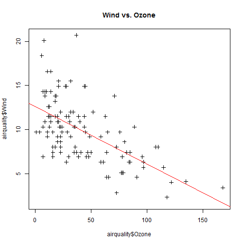
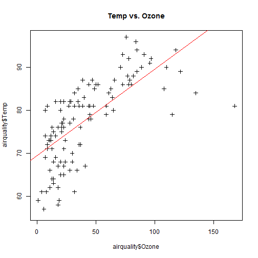
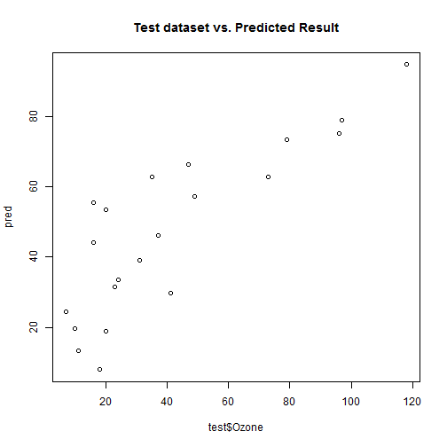

How Weather Condition Affects Ozone Concentration
========================================================
author: WANG Xin
date: 2016-6-15

Ozone Basics
========================================================

- Ozone is a gas composed of three atoms of oxygen (O3)
- Ozone can be good or bad, depending on where it is found
- High concentration of ozone near ground level is harmful to people, aninals, crops, and other materials
- Many factors impact ground-level ozone development, including temperature, wind speed and direction, time of the day, and driving patterns

More information:
https://www.epa.gov/ozone-pollution 

Look at some data
========================================================


Atmospheric Stability

***


Photochemical Condition

Model and Result
========================================================


The correlation coefficient of test dataset and predicted result is:

```
[1] 0.8428985
```
The Wind and Temp seems good predictors of ozone.

***



Notes
========================================================

- The data comes from _airquality_ {a base R dataset}, which is very very old (1973).

- Train the model with more recent data, because the level of ozone precusors may change with the time being.   

- Play the model online with more options: https://vvxin.shinyapps.io/CourseraShinyApp/

- This 5 page presentation is part of assignment of Cousera course: *Developing Data Product*. The work is done in RStudio Presenter. Plots and model result are automatically generated by embedded R code. 
